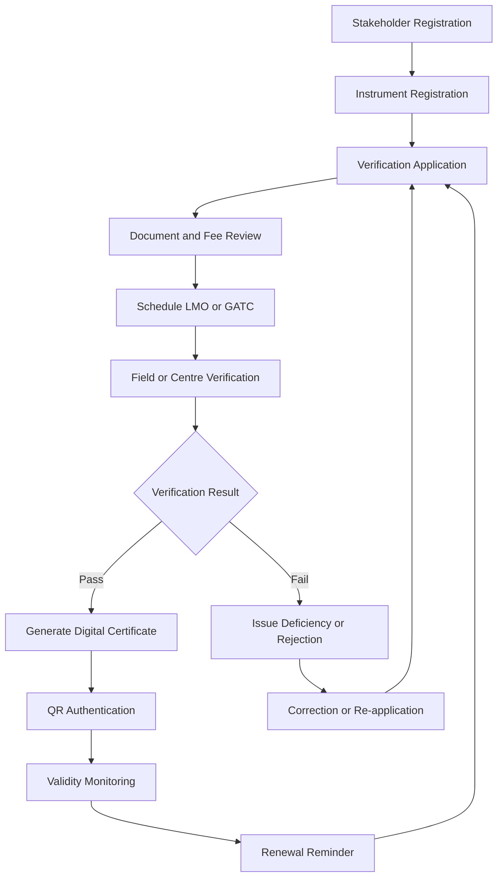
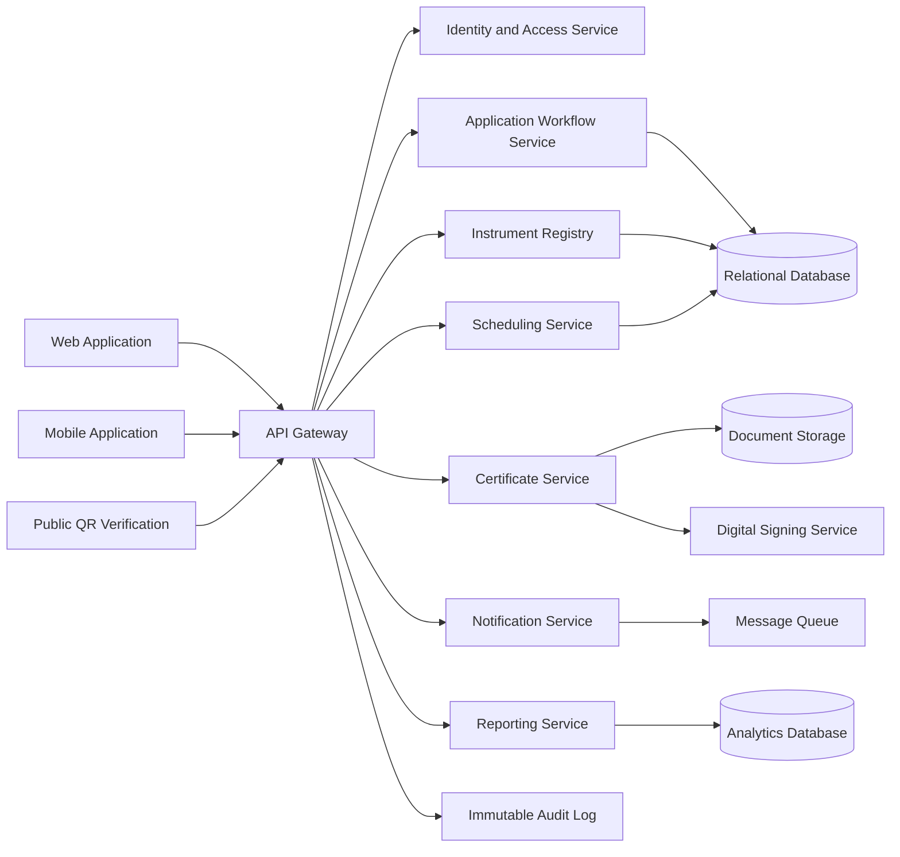

# Legal Metrology Verification and Digital Certification Platform

## 1. Document Purpose

This document defines the end-to-end product, technical, operational, security, implementation, and rollout plan for a unified online verification and digital certification platform for weighing and measuring instruments regulated under the Legal Metrology Act, 2009 and the Legal Metrology (General) Rules, 2011.

The platform will digitize the complete lifecycle:

```text
Stakeholder Registration -> Instrument Registration -> Application -> Review and Fee -> Scheduling -> Verification -> Certificate -> Monitoring -> Re-verification
```

The solution should be configurable so that state-specific workflows, fees, validity periods, instrument categories, certificate templates, and departmental procedures can be changed without rewriting core software.

## 2. Product Vision and Objectives

The platform will provide a secure web and mobile-enabled system for:

- Registering businesses, instrument owners, State Legal Metrology Officers (LMOs), Government Approved Test Centres (GATCs), administrators, and other stakeholders.
- Accepting applications for initial verification and re-verification.
- Scheduling and allocating verification activities.
- Capturing inspection observations, test readings, photographs, documents, signatures, GPS coordinates, and timestamps.
- Generating digitally authenticated verification certificates with QR codes.
- Maintaining a centralized instrument and certificate repository.
- Monitoring validity periods, expiry dates, pendency, and enforcement activity.
- Providing public certificate authentication without exposing sensitive personal information.
- Supporting field verification through an offline-capable mobile application.
- Improving transparency, compliance, processing time, and access to verification history.

## 3. Legal and Regulatory Scope

The implementation should be reviewed and approved by the competent Legal Metrology authorities against:

- Legal Metrology Act, 2009.
- Legal Metrology (General) Rules, 2011.
- Applicable state Legal Metrology rules, notifications, fee schedules, and departmental procedures.
- Information Technology Act and applicable rules.
- Digital Personal Data Protection requirements.
- Government accessibility, cybersecurity, hosting, records-retention, and digital-signature standards.

The software must not hard-code assumptions that may vary by jurisdiction. Rules should be represented as versioned configuration with effective dates and approval history.

## 4. Stakeholders and Roles

| Role | Main capabilities |
| --- | --- |
| Instrument Owner / Business | Manage profile, register instruments, submit applications, upload documents, pay fees, track status, download certificates, request re-verification |
| Legal Metrology Officer | View assigned work, conduct inspections, record observations, upload evidence, approve or reject verification, issue certificates where authorized |
| GATC Operator | Manage centre capacity, receive appointments, conduct tests, record readings, submit reports, recommend pass or fail |
| State Administrator | Manage state and district data, officers, GATCs, fees, workflows, reports, escalations, and enforcement configuration |
| Central Administrator | Manage states, global master data, platform configuration, security, audit, analytics, and system-wide controls |
| Inspector / Enforcement Officer | Search instruments and certificates, scan QR codes, verify status, record enforcement actions |
| Consumer / Public User | Verify a certificate using a QR code, certificate number, instrument number, or public verification token |
| Helpdesk User | View permitted user and application details, manage support cases, and record resolutions |

Access must be controlled by both role and jurisdiction. A user should only see data necessary for their department, state, district, GATC, assignment, or public verification purpose.

## 5. Functional Modules

### 5.1 Stakeholder Registration and Profiles

Features:

- Registration for instrument owners, businesses, LMOs, GATCs, administrators, and other authorized users.
- Mobile number and email verification.
- Organisation profile, address, jurisdiction, and authorized representatives.
- PAN, GSTIN, licences, department identifiers, accreditation details, and other applicable information.
- Identity and supporting-document upload.
- Approval workflow for regulated stakeholders.
- Profile updates with approval where required.
- Account suspension, reactivation, and deactivation.
- Delegated access for authorized business representatives.

### 5.2 Instrument Registry

Every instrument must receive a unique platform identifier. The registry should store:

- Instrument ID.
- Instrument type and category.
- Manufacturer and model.
- Serial number.
- Capacity, range, least count, accuracy class, and other technical specifications.
- Year of manufacture.
- Location and premises where the instrument is used.
- Owner or organisation.
- Previous verification and certificate history.
- Current status and next verification due date.
- Photographs, invoices, permissions, and supporting documents.
- Repair, adjustment, relocation, suspension, retirement, and enforcement history.

Suggested instrument statuses:

```text
Draft, Active, Pending Verification, Verified, Rejected, Expired, Suspended, Retired
```

### 5.3 Verification and Re-verification Applications

Supported application types:

- Initial verification.
- Periodic re-verification.
- Verification after repair.
- Verification after relocation.
- Verification after adjustment.
- Special inspection.
- Correction or rejection appeal.

Application flow:

1. Applicant selects an existing instrument or registers a new instrument.
2. Applicant enters verification details.
3. Applicant uploads photographs and supporting documents.
4. System determines the applicable fee using configured rules.
5. Applicant submits the application.
6. System generates an application number.
7. Department or GATC reviews the application.
8. Missing information is requested when necessary.
9. Payment is recorded or confirmed.
10. Verification is scheduled and assigned.
11. Applicant receives status and appointment notifications.

### 5.4 Scheduling and Allocation

Required capabilities:

- Calendar-based scheduling for field visits and GATC appointments.
- Assignment by jurisdiction, instrument category, workload, skill, availability, and authorization.
- GATC capacity and operating-hours management.
- LMO availability, leave, and workload management.
- Field visit route planning.
- Rescheduling and cancellation with reasons.
- Priority and urgent application handling.
- Conflict detection.
- SLA and overdue tracking.
- Applicant appointment confirmation and reminders.

### 5.5 Field Verification Mobile Application

The mobile application should support LMOs and authorized GATC field staff with:

- Secure login and multi-factor authentication.
- Assigned-work list and daily schedule.
- Offline access to assigned applications.
- GPS capture and timestamping.
- Instrument photograph and evidence capture.
- QR and barcode scanning.
- Instrument identity and serial-number confirmation.
- Digital inspection checklist.
- Test-reading and measurement entry.
- Observation, defect, non-conformity, and remarks entry.
- Applicant and officer signatures.
- Offline encrypted local storage.
- Synchronization after connectivity is restored.
- Duplicate and conflict resolution.
- Device registration, remote logout, and local-data removal.

The mobile application must prevent unauthorized editing after submission. Corrections should create a new revision or controlled amendment with a reason and audit record.

### 5.6 Digital Verification Certificates

A certificate should include, as legally applicable:

- Government and department details.
- Certificate number and application number.
- Instrument ID.
- Owner or business details permitted by policy.
- Instrument type, manufacturer, model, and serial number.
- Capacity, range, accuracy, and other specifications.
- Verification date and location.
- Validity period and next due date.
- LMO or GATC details.
- Verification result and conditions.
- Remarks, limitations, or corrective requirements.
- Digital signature or approved electronic authentication.
- QR code and unique public verification token.
- Certificate hash or tamper-detection value.

Certificates must support revision, revocation, suspension, replacement, and reissue without deleting the historical record.

### 5.7 Public Certificate Verification

A public user should be able to verify a certificate by:

- Scanning its QR code.
- Entering a certificate number.
- Entering an instrument ID or serial number where permitted.
- Entering a public verification token.

The public page should show:

- Valid, expired, suspended, revoked, or not-found status.
- Instrument category.
- Manufacturer and model.
- Serial number, masked if required.
- Verification date.
- Validity date.
- Issuing authority.
- Certificate authenticity result.

The public service must not expose private phone numbers, addresses, identity documents, financial details, or unnecessary owner information.

### 5.8 Dashboards

#### Applicant dashboard

- Total instruments.
- Pending applications.
- Approved and rejected applications.
- Expiring and expired certificates.
- Upcoming appointments.
- Downloadable certificates.
- Outstanding documents or actions.

#### LMO dashboard

- Assigned verifications.
- Today’s field visits.
- Pending approvals.
- Failed inspections.
- Overdue applications.
- District-wise activity.
- Workload and turnaround time.

#### GATC dashboard

- Centre capacity and availability.
- Scheduled tests.
- Completed tests.
- Pending reports.
- Instrument category statistics.
- Staff workload.
- Failure and re-test statistics.

#### Administrator dashboard

- State, district, and GATC verification volume.
- Pending and overdue applications.
- Average processing time.
- Certificate expiry trends.
- Rejection and failure rates.
- Officer and GATC performance.
- Enforcement activity.
- User adoption and system activity.
- Audit and security events.

## 6. End-to-End Workflow



## 7. Application State Model

Use a controlled state machine. Users must not be able to move an application to arbitrary states.

```text
Draft
Submitted
Under Review
Awaiting Documents
Payment Pending
Payment Confirmed
Scheduled
Assigned
Inspection In Progress
Passed
Failed
Certificate Generated
Certificate Issued
Expired
Suspended
Cancelled
Rejected
Appeal Submitted
```

Every transition must record:

- User and role.
- Timestamp.
- Previous status.
- New status.
- Reason or comment.
- IP address and device information where appropriate.
- Related documents and evidence.

## 8. Proposed Technical Architecture



The first production release should use a modular monolith or well-separated application modules unless traffic, organisational boundaries, or operational requirements clearly justify microservices. This reduces early complexity while preserving clear ownership boundaries.

### 8.1 Recommended technology stack

Frontend:

- React and TypeScript.
- Responsive desktop, tablet, and mobile browser interface.
- An established component library or government design system.
- Progressive Web App capability where useful.

Mobile:

- Flutter or React Native.
- Encrypted SQLite or equivalent local storage.
- Background synchronization.
- Camera, GPS, QR scanning, and secure device storage.

Backend:

- Java Spring Boot or .NET ASP.NET Core.
- REST APIs with versioning.
- PostgreSQL or another government-approved relational database.
- Redis for caching and short-lived workflow data.
- Background jobs for reminders, reporting, and certificate processing.
- Object storage for documents, photographs, and generated certificates.

Infrastructure:

- Government-approved cloud or state data centre.
- Docker containers.
- Kubernetes or a managed container platform when justified.
- Managed database and object storage.
- Centralized logging and monitoring.
- Web Application Firewall.
- CDN or caching for public certificate verification where appropriate.

## 9. Data Model

Core entities:

```text
User
Role
Organisation
Department
State
District
Jurisdiction
GATC
Instrument
InstrumentType
Manufacturer
Owner
Application
ApplicationDocument
VerificationAppointment
Inspection
InspectionChecklist
InspectionObservation
TestReading
Certificate
CertificateRevision
Payment
Notification
Appeal
EnforcementAction
AuditEvent
```

Key relationships:

```text
Owner 1---N Instrument
Instrument 1---N Application
Application 1---1 Inspection
Inspection 1---0..1 Certificate
Certificate 1---N CertificateRevision
Application 1---N ApplicationDocument
LMO/GATC 1---N VerificationAppointment
Certificate 1---N PublicVerificationRequest
```

Data design requirements:

- Use immutable identifiers for instruments, applications, and certificates.
- Store effective dates for rules and master data.
- Preserve certificate and application history.
- Avoid hard deletion of regulated records.
- Apply retention and archival policies.
- Track source and verification status for migrated legacy records.
- Maintain separate public and private views of data.

## 10. Security and Privacy Framework

### 10.1 Authentication

- Use a government identity provider where available.
- Use mobile and email OTP for appropriate users.
- Require multi-factor authentication for officials and administrators.
- Enforce strong password and account-lockout policies.
- Support session expiry, token rotation, device management, and revocation.

### 10.2 Authorization

- Role-based access control.
- State, district, jurisdiction, and assignment-level restrictions.
- Least-privilege permissions.
- Separate public and authenticated APIs.
- Separation of duties for inspection, approval, and administration.
- Approval for privilege changes.

### 10.3 Data protection

- TLS for all network traffic.
- Encryption at rest for databases, object storage, backups, and mobile data.
- Secure, time-limited document URLs.
- Sensitive-data masking.
- Secret storage in a managed key vault.
- Regular backups with encryption.
- Controlled administrator access.

### 10.4 Audit and integrity

- Append-only or immutable audit logs.
- Certificate hash and digital signing.
- Certificate versioning and revocation history.
- Full audit of status changes, edits, approvals, downloads, and public verification requests.
- Detection and alerting for suspicious access or certificate activity.

### 10.5 Security testing

Test for:

- Broken authentication.
- Broken authorization and jurisdiction bypass.
- Insecure direct object references.
- SQL injection and XSS.
- CSRF and insecure CORS.
- Malicious file uploads.
- Sensitive-data exposure.
- Session and token weaknesses.
- Mobile local-storage exposure.
- Certificate tampering and QR abuse.
- Rate-limit and denial-of-service risks.

## 11. Notifications and Reminders

Supported channels:

- SMS.
- Email.
- In-app notifications.
- Mobile push notifications.
- Optional government messaging or WhatsApp integration subject to approval.

Notification events:

- Registration approval.
- Application submission.
- Missing-document request.
- Payment confirmation.
- Appointment scheduling, change, and cancellation.
- Verification result.
- Certificate issuance.
- Certificate suspension, revocation, or expiry.
- Officer assignment.
- Application overdue.
- Enforcement action.

Default expiry reminders:

```text
90 days before expiry
60 days before expiry
30 days before expiry
7 days before expiry
On expiry
```

All templates, channels, schedules, language variants, and retry rules should be configurable and auditable.

## 12. API Design

Suggested API groups:

```text
/auth
/users
/organisations
/instruments
/applications
/appointments
/inspections
/checklists
/certificates
/public/verify
/payments
/notifications
/reports
/enforcement
/audit
/master-data
```

Example endpoints:

```text
POST   /api/instruments
GET    /api/instruments/{id}
POST   /api/applications
GET    /api/applications/{id}
POST   /api/applications/{id}/submit
POST   /api/appointments
POST   /api/inspections/{id}/complete
POST   /api/certificates/{id}/issue
GET    /api/public/certificates/{token}
POST   /api/certificates/{id}/suspend
```

API standards:

- Version all public APIs.
- Validate all input server-side.
- Apply authorization at every resource boundary.
- Use pagination, filtering, sorting, and search limits.
- Return consistent error structures.
- Use idempotency keys for submissions, payments, and synchronization.
- Apply rate limits, request tracing, and structured logging.
- Document APIs using OpenAPI.
- Never trust client-side status, role, location, or verification values.

## 13. Search, Reports, and Exports

Search fields:

- Certificate number.
- Application number.
- Instrument ID.
- Serial number.
- Owner or organisation.
- Manufacturer and model.
- District and jurisdiction.
- GATC and LMO.
- Verification date.
- Expiry date.
- Current status.

Reports:

- Verification activity.
- Expiring instruments.
- Expired instruments.
- Pending and overdue applications.
- Officer workload.
- GATC performance.
- Rejection and failure reasons.
- State and district summaries.
- Enforcement actions.
- Audit and access reports.
- Processing-time and SLA reports.

Export formats:

- PDF.
- Excel.
- CSV.
- Printable certificate format.

Exports must respect the requesting user's data scope and should be logged for audit purposes.

## 14. Legacy Data Migration

Many departments may have physical records or isolated local systems. Migration should be handled as a separate workstream:

1. Inventory existing records and systems.
2. Define the canonical data model.
3. Map legacy fields to platform fields.
4. Scan and index applicable certificates and documents.
5. Clean duplicate owners, instruments, and serial numbers.
6. Validate data with the responsible department.
7. Import records into a staging area.
8. Run reconciliation and exception reports.
9. Approve and publish records.
10. Preserve the source system and migration history.

Migrated records should clearly indicate whether they are verified, imported, scanned, or awaiting confirmation.

## 15. Implementation Phases

### Phase 0: Discovery and legal validation, 2 to 4 weeks

Deliverables:

- State-wise process maps.
- Legal and compliance review.
- Certificate format and QR requirements.
- Instrument category catalogue.
- Fee and validity rules.
- Role and authority matrix.
- Government integration inventory.
- Data retention and privacy policy.
- Product requirements and acceptance criteria.

### Phase 1: MVP, 10 to 14 weeks

Scope:

- User registration and login.
- Stakeholder profiles.
- Instrument registry.
- Application submission.
- Document upload.
- Basic fee recording.
- Scheduling.
- LMO and GATC assignment.
- Inspection result entry.
- Digital certificate generation.
- QR verification.
- Email and SMS notifications.
- Basic dashboards.
- Audit logs.

### Phase 2: Field operations, 8 to 12 weeks

Scope:

- Android and iOS field application.
- Offline inspection workflow.
- GPS and timestamp capture.
- Camera and QR integration.
- Digital signatures.
- Synchronization and conflict handling.
- Route and appointment management.
- Device management.

### Phase 3: Administration and scale, 8 to 12 weeks

Scope:

- Multi-state configuration.
- Advanced dashboards and analytics.
- Online payment integration.
- Appeals and corrections.
- Enforcement workflows.
- Bulk legacy imports.
- Advanced reporting.
- External system integrations.
- Performance and operational monitoring.

### Phase 4: Hardening and rollout, 4 to 8 weeks

Scope:

- Security testing and remediation.
- Performance and load testing.
- Accessibility testing.
- User acceptance testing.
- Pilot deployment in one state or district.
- User training and support.
- Production rollout.
- Disaster recovery test.
- Post-launch review.

## 16. MVP Success Criteria

The first production pilot is successful when:

- A stakeholder can register and be approved online.
- An instrument can be registered with documents and photographs.
- A verification or re-verification application can be submitted.
- The application can be reviewed and assigned to an LMO or GATC.
- An inspection can be completed digitally.
- A certificate can be generated with a QR code.
- A third party can verify the certificate publicly.
- Expiry reminders are sent automatically.
- Administrators can view pendency and status dashboards.
- Every material action is available in the audit trail.
- The workflow is accepted by participating LMOs, GATCs, and businesses.

## 17. Testing Strategy

### 17.1 Functional testing

- Registration and account approval.
- Login, logout, password recovery, and MFA.
- Stakeholder and instrument profile management.
- Application submission and amendment.
- Document upload and validation.
- Fee calculation or recording.
- Scheduling and rescheduling.
- Assignment and approval.
- Inspection and test-reading entry.
- Certificate generation and download.
- QR and public verification.
- Status transitions and revocation.
- Expiry reminders.
- Reports and exports.
- Appeals and enforcement.

### 17.2 Integration testing

Test integrations with:

- Identity provider.
- SMS and email gateways.
- Payment gateway.
- Digital-signature or signing service.
- Object storage.
- Government master-data systems.
- Notification queue.
- Analytics and reporting services.

### 17.3 Performance targets

Initial planning targets:

- 10,000 concurrent users.
- 1,000 applications per hour.
- Public certificate verification response under 2 seconds under normal load.
- Availability of at least 99.5 percent, subject to hosting policy.
- Daily backup with point-in-time recovery.

These targets must be recalculated after expected state-wide volumes are confirmed.

### 17.4 Field testing

Test:

- Poor or intermittent network.
- Offline inspection and synchronization.
- GPS unavailable or inaccurate.
- Duplicate submissions.
- Conflicting updates.
- Device replacement.
- Camera and QR scanning.
- Certificate access in the field.
- Battery, storage, and low-end device constraints.

## 18. Deployment and Operations

Required environments:

```text
Development
Testing
Staging
Production
Disaster Recovery
```

Operational requirements:

- CI/CD pipeline with approval gates.
- Automated database migrations.
- Infrastructure as code.
- Centralized logs and metrics.
- Application performance monitoring.
- Error tracking and alerting.
- Vulnerability and dependency scanning.
- Secrets management.
- Encrypted and tested backups.
- Disaster recovery plan.
- Incident response process.
- Operational runbooks.
- Defined service-level objectives.

Suggested initial disaster recovery targets:

- Recovery Point Objective: 15 minutes.
- Recovery Time Objective: 2 hours.
- Daily full backups and continuous or frequent transaction backups.
- Point-in-time database recovery.
- Monthly disaster recovery drills.

## 19. Accessibility and Usability

The platform should:

- Support responsive desktop and mobile layouts.
- Use clear language suitable for government users and businesses.
- Support keyboard navigation and screen readers.
- Provide adequate contrast and visible focus indicators.
- Avoid relying on color alone for status.
- Support local-language content where required.
- Provide accessible PDFs where legally required.
- Offer clear validation, error, and next-action messages.
- Minimize duplicate data entry.
- Preserve drafts when a user loses connectivity or a session expires.

## 20. Risks and Mitigations

| Risk | Mitigation |
| --- | --- |
| Different state-level procedures | Configurable workflows, master data, validity rules, and certificate templates |
| Unreliable field connectivity | Offline-first mobile application with encrypted synchronization |
| Certificate misuse | QR verification, digital signatures, hashes, revocation, and public status checking |
| Incorrect officer allocation | Jurisdiction, authorization, skill, availability, and workload rules |
| Privacy concerns | Data minimization, masked public data, and strict access control |
| Legacy records unavailable digitally | Scanning, bulk import, data cleansing, and source-reference fields |
| User adoption challenges | Training, helpdesk, pilot rollout, and simple workflows |
| Fraudulent inspection records | GPS, timestamps, evidence photographs, signatures, and audit logs |
| High storage cost | Compression, retention policy, archival tiers, and lifecycle management |
| Future rule changes | Versioned configurations with effective dates and approval history |
| Integration failure | Queue-based retries, monitoring, reconciliation, and manual fallback procedures |
| Mobile device loss | Device registration, encrypted local data, remote logout, and data wipe |

## 21. Project Team

Recommended team:

- Product owner from the Legal Metrology Department.
- Legal and compliance expert.
- Business analyst.
- UX and accessibility designer.
- Solution architect.
- Backend developers.
- Web frontend developers.
- Mobile developers.
- QA automation engineer.
- Security engineer.
- DevOps and cloud engineer.
- Data migration specialist.
- Training and support team.

## 22. Initial Project Deliverables

The project should begin by producing:

1. Software Requirements Specification.
2. Stakeholder and role matrix.
3. State-wise process map.
4. Instrument category and master-data catalogue.
5. Certificate and QR-code specification.
6. Security and privacy design.
7. API specification.
8. Database schema and data dictionary.
9. UI wireframes and prototype.
10. Mobile offline synchronization design.
11. Deployment architecture.
12. Test strategy and acceptance criteria.
13. Data migration plan.
14. Pilot rollout plan.
15. Training, helpdesk, and support plan.
16. Operations, backup, and disaster recovery runbook.

## 23. Recommended First Pilot

Start with one state, district, or clearly bounded jurisdiction and include a representative sample of:

- Instrument owners and businesses.
- LMOs.
- At least one GATC.
- State and district administrators.
- Enforcement officers.
- Public certificate users.

The pilot should cover the complete lifecycle, including registration, application, scheduling, field or centre verification, certificate issuance, QR verification, expiry reminders, correction or rejection, and reporting. Expand to additional jurisdictions only after operational acceptance, security review, data-quality review, and performance validation.

## 24. Definition of Done for Production Readiness

The platform is ready for production when:

- Legal and departmental workflows are approved.
- Role permissions and jurisdiction boundaries are tested.
- Core workflows pass functional and integration testing.
- Mobile offline synchronization is reliable under field conditions.
- Certificates are digitally authenticated and publicly verifiable.
- Certificate suspension and revocation are supported.
- Security assessment findings are resolved or formally accepted.
- Accessibility and usability testing is complete.
- Data migration has reconciliation evidence.
- Backup restoration and disaster recovery have been tested.
- Monitoring, alerting, support, and incident procedures are operational.
- Users are trained and pilot acceptance is documented.
- Privacy, retention, and audit requirements are approved.

## 25. Conclusion

The recommended approach is to build a configurable, secure, modular platform and validate it through a focused pilot. The first release should prioritize the regulated workflow and trustworthy certificate verification. Mobile offline field capability, advanced administration, payments, legacy migration, analytics, and multi-state scale should then be added in controlled phases.

This approach provides a practical path from manual, fragmented verification processes to a transparent digital Legal Metrology ecosystem with centralized records, authenticated certificates, measurable service performance, and easier compliance for businesses and the public.

## 26. Detailed Build Plan: Start to Production

This section converts the product scope above into an executable engineering plan. Work should be delivered in vertical slices so that each slice includes database changes, backend APIs, frontend screens, permissions, notifications, audit events, tests, and documentation.

### 26.1 Delivery principles

1. Start with one pilot state and one bounded jurisdiction.
2. Build a modular monolith first, with explicit modules and stable API contracts.
3. Treat application and certificate state transitions as server-owned state machines.
4. Treat regulated records as append-only history; use revisions, suspension, replacement, and archival instead of deletion.
5. Build authorization, audit logging, validation, and observability into every feature.
6. Keep state rules, fees, validity periods, templates, categories, and notification content configurable.
7. Complete one end-to-end workflow before expanding to advanced reporting or multi-state scale.

### 26.2 Target repository structure

```text
platform/
    frontend/                 React web application
    mobile/                   Flutter or React Native field application
    backend/                  Spring Boot or ASP.NET Core API
    database/                 migrations, seed data, data dictionary
    infrastructure/           IaC, containers, environments, monitoring
    docs/                     requirements, API, security, runbooks, training
    tests/                    contract, integration, performance, security, E2E
```

### 26.3 Workstream A: Discovery and foundation

**A1. Confirm business and legal rules**

- Confirm state, district, jurisdiction, LMO, GATC, and administrator boundaries.
- Approve application states, transition permissions, SLA timers, escalation rules, and appeal rules.
- Catalogue instrument categories, required fields, checklists, fees, validity periods, and certificate templates.
- Approve public certificate fields, QR payload, digital-signature method, retention periods, and privacy masking.
- Produce the requirements traceability matrix linking each requirement to a screen, API, table, permission, notification, and test.

**A2. Establish engineering standards**

- Create branching, code review, release, and migration policies.
- Define API versioning, error format, pagination, filtering, idempotency, correlation IDs, and audit-event format.
- Configure development, test, staging, production, and disaster-recovery environments.
- Add linting, formatting, type checking, unit-test coverage thresholds, dependency scanning, secret scanning, and CI quality gates.

**A3. Design the user experience**

- Create responsive wireframes for applicant, LMO, GATC, administrator, enforcement, helpdesk, and public verification journeys.
- Define reusable form, table, upload, status, timeline, calendar, map, signature, notification, and error components.
- Define keyboard navigation, focus states, screen-reader labels, contrast, local-language strategy, and accessible PDF requirements.

**Exit criteria:** approved requirements, role matrix, state machine, data dictionary, API conventions, wireframes, security model, and pilot scope.

### 26.4 Workstream B: Database and data platform

**B1. Implement database foundation**

- Use PostgreSQL or the approved relational database.
- Add migration tooling, seed data, UUID or equivalent immutable identifiers, UTC timestamps, optimistic locking, and soft archival fields.
- Add `created_by`, `created_at`, `updated_by`, `updated_at`, `version`, and source-migration fields where appropriate.
- Add indexes for application number, certificate number, instrument ID, serial number, status, jurisdiction, owner, and expiry date.

**B2. Create core tables**

- Identity: `users`, `roles`, `permissions`, `user_roles`, `organisations`, `organisation_members`, `departments`.
- Jurisdiction: `states`, `districts`, `jurisdictions`, `gatcs`, `officer_assignments`.
- Master data: `instrument_types`, `manufacturers`, `fee_rules`, `validity_rules`, `checklists`, `workflow_rules`, `certificate_templates`.
- Registry: `instruments`, `instrument_documents`, `instrument_events`, `instrument_locations`.
- Workflow: `applications`, `application_documents`, `application_events`, `application_assignments`, `application_comments`.
- Verification: `appointments`, `inspections`, `inspection_observations`, `test_readings`, `inspection_media`, `signatures`.
- Certificates: `certificates`, `certificate_revisions`, `certificate_public_tokens`, `certificate_revocations`.
- Platform services: `payments`, `notifications`, `notification_deliveries`, `appeals`, `enforcement_actions`, `audit_events`, `outbox_events`.

**B3. Enforce regulated-record integrity**

- Add database constraints for unique instrument IDs, serial-number rules, application numbers, certificate numbers, and public tokens.
- Store every state transition in an event/history table.
- Prevent hard deletion of applications, inspections, certificates, payments, and audit events.
- Separate private document metadata from public certificate verification data.
- Add retention, archival, and migrated-record status fields.

**B4. Data migration foundation**

- Create staging tables and import templates for owners, instruments, applications, certificates, and scanned files.
- Add duplicate detection for owners, serial numbers, and certificate numbers.
- Add validation, reconciliation, exception reporting, approval, and source-reference tracking.

**Exit criteria:** repeatable migrations, seeded pilot master data, ERD, data dictionary, constraints, indexes, backup/restore test, and migration reconciliation report.

### 26.5 Workstream C: Backend and API

**C1. Platform and identity module**

- Implement configuration management, health checks, API versioning, OpenAPI, structured errors, request tracing, and rate limiting.
- Integrate the approved identity provider, OTP, MFA, password recovery, session expiry, token rotation, device registration, and logout/revocation.
- Implement RBAC plus state, district, jurisdiction, GATC, and assignment scopes.
- Add policy checks at every resource endpoint; never trust role, status, location, or fee values from the client.

**C2. Stakeholder and organisation APIs**

- Registration, email/mobile verification, profile, organisation representatives, documents, approval, suspension, reactivation, and delegated access.
- Add reviewer queues and approval/rejection reasons.
- Add audit events and notifications for all approval decisions.

**C3. Instrument registry APIs**

- Create, update, view, search, assign owner, relocate, repair, adjust, suspend, retire, and restore instrument records.
- Validate category-specific technical fields and required documents.
- Expose instrument history, current certificate, due date, and enforcement history according to scope.

**C4. Application and workflow APIs**

- Draft, save, submit, request documents, upload documents, calculate fee, record payment, assign, schedule, reschedule, cancel, approve, reject, appeal, and re-apply.
- Implement the controlled state machine from Section 7 with transition guards and reasons.
- Use idempotency keys for submit, payment, upload finalization, and mobile synchronization.

**C5. Scheduling and allocation APIs**

- Manage officer/GATC availability, capacity, operating hours, leave, skills, authorizations, and workload.
- Implement jurisdiction, category, workload, availability, conflict, priority, and SLA rules.
- Provide calendar, appointment confirmation, rescheduling, cancellation, reminder, and overdue endpoints.

**C6. Inspection and field APIs**

- Create assigned inspection, download an offline work package, capture checklist results, readings, observations, media, GPS, timestamps, and signatures.
- Lock submitted inspections and require controlled revisions for corrections.
- Implement sync batches, idempotency, version checks, conflict results, retry states, and device revocation.

**C7. Certificate APIs**

- Generate certificate from approved inspection data and versioned template.
- Create certificate number, hash, QR payload, public token, revision, issue, download, suspend, revoke, replace, and reissue operations.
- Integrate approved signing service and object storage using time-limited URLs.

**C8. Public verification APIs**

- Provide QR/token, certificate-number, and permitted instrument/serial searches.
- Return only masked public fields and status: valid, expired, suspended, revoked, or not found.
- Add strict rate limits, abuse monitoring, cache policy, and verification audit events.

**C9. Notifications, payments, reports, and enforcement**

- Implement an outbox and queue for SMS, email, in-app, push, and approved messaging channels.
- Add configurable templates, languages, schedules, retries, delivery status, and expiry reminders at 90, 60, 30, 7, and 0 days.
- Add payment gateway adapter with reconciliation and webhook verification.
- Add report query services with scoped PDF, Excel, CSV, and printable exports.
- Add enforcement search, QR scan result, action recording, evidence, follow-up, and audit APIs.

**Exit criteria:** OpenAPI is approved, authorization tests pass, every write creates an audit event, background jobs are retryable, and the complete pilot workflow works through API tests.

### 26.6 Workstream D: Web frontend

**D1. Application shell and shared UI**

- Replace the current static dashboard with authenticated routing and role-aware navigation.
- Build shared layout, sidebar, top bar, breadcrumbs, page headers, cards, tables, filters, pagination, forms, modals, drawers, upload controls, status badges, timelines, toasts, and empty/error/loading states.
- Add responsive desktop/tablet/mobile behavior, keyboard support, focus visibility, and accessible labels.
- Add API client, auth/session handling, query cache, optimistic updates only where safe, and consistent API error handling.

**D2. Applicant portal**

- Registration, login, MFA, profile, organisation, representative access, document management, and approval status.
- Instrument list, instrument registration/edit, technical specification forms, photos/documents, location, history, and due dates.
- Application wizard for initial, periodic, repair, relocation, adjustment, special inspection, and appeal flows.
- Draft autosave, document validation, fee summary, payment, submission confirmation, application timeline, appointment, certificate download, and renewal actions.

**D3. LMO and GATC workspaces**

- Assigned queue, calendar, workload, SLA filters, map/list view, appointment details, applicant contact scope, and assignment actions.
- Inspection checklist, readings, defect/observation entry, photo and document capture, signature, pass/fail recommendation, submit lock, and correction workflow.
- GATC capacity, operating hours, staff workload, test results, pending reports, and re-test statistics.

**D4. Administration workspace**

- User, role, organisation, district, jurisdiction, officer, GATC, instrument category, checklist, fee, validity, workflow, notification, and certificate-template management.
- Approval queues, escalations, appeals, enforcement, audit search, security events, imports, reconciliation exceptions, and configuration effective dates.

**D5. Dashboards, search, reports, and public verification**

- Applicant, LMO, GATC, state administrator, central administrator, enforcement, and helpdesk dashboards from Section 5.8.
- Global scoped search for certificates, applications, instruments, serial numbers, owners, manufacturers, districts, GATCs, LMOs, dates, expiry, and status.
- Report filters, export progress, download history, and permission-aware columns.
- Public QR verification page with masked data, authenticity state, certificate dates, issuing authority, and revocation/suspension information.

**D6. Helpdesk and notifications**

- Support case list, permitted user/application view, assignment, notes, status, resolution, and audit history.
- Notification centre, read/unread state, preferences, delivery status, and action links.

**Exit criteria:** each role can complete its pilot journey in the browser, inaccessible actions are hidden and server-blocked, responsive/accessibility tests pass, and all screens handle loading, empty, error, and expired-session states.

### 26.7 Workstream E: Mobile field application

1. Create secure login, MFA, device registration, remote logout, and local-data removal.
2. Download assigned work packages with only the necessary jurisdiction-scoped data.
3. Build offline checklist, readings, GPS, timestamp, camera, QR/barcode scan, evidence, remarks, and signatures.
4. Encrypt local SQLite storage and protect keys with platform secure storage.
5. Queue offline changes with idempotency keys and upload status.
6. Implement reconnect sync, version checks, duplicate prevention, conflict resolution, retry, and user-visible sync errors.
7. Lock submitted inspections and support controlled amendments with reasons.
8. Test poor network, GPS failure, duplicate submission, conflict, device replacement, low storage, low battery, and app restart scenarios.

**Exit criteria:** an LMO can complete and submit an inspection without connectivity, synchronize later without duplication, and produce the same server-side inspection record as the online workflow.

### 26.8 Workstream F: Security, privacy, and compliance

- Threat-model authentication, authorization, public verification, uploads, QR tokens, mobile sync, payments, certificates, and admin functions.
- Implement TLS, encryption at rest, key vault, secret rotation, signed URLs, malware/file validation, sensitive-field masking, and backup encryption.
- Add immutable audit logs for login, permission changes, reads of sensitive data, downloads, exports, status changes, approvals, certificate events, and public verification.
- Run SAST, dependency/CVE scan, secret scan, DAST, API authorization tests, upload abuse tests, rate-limit tests, mobile storage review, and certificate-tampering tests.
- Complete privacy impact assessment, retention schedule, consent/legal notice review, incident process, and security acceptance before pilot.

### 26.9 Workstream G: Testing and quality gates

**Automated tests**

- Backend unit tests for rules, fees, state transitions, permissions, QR payload, certificate hash, and reminders.
- Frontend component and form tests for validation, permissions, filtering, upload states, and error handling.
- Mobile unit tests for local database, encryption wrapper, queue, sync, conflict, and retry logic.
- API contract tests generated from OpenAPI.
- Integration tests for database, object storage, queue, identity provider, SMS/email, signing, and payment adapters.
- End-to-end tests for registration to certificate, failure/re-application, expiry reminder, public verification, suspension, revocation, and report export.

**Quality gates**

1. Pull request: lint, type check, unit tests, migration validation, dependency scan.
2. Test environment: integration, contract, permission, accessibility, and smoke tests.
3. Staging: E2E, load, security, backup restore, DR rehearsal, and UAT.
4. Production: approved release notes, migration plan, rollback plan, monitoring dashboard, support runbook, and business sign-off.

### 26.10 Workstream H: Infrastructure and operations

- Package web, API, worker, and mobile backend services with containers.
- Provision environments using infrastructure as code.
- Configure managed database, object storage, cache, message queue, key vault, WAF, CDN where appropriate, and private networking.
- Add CI/CD with environment approvals, database migration gates, blue/green or rolling deployment, health checks, and rollback.
- Add centralized logs, metrics, traces, error tracking, dashboards, alerts, audit retention, and cost monitoring.
- Automate encrypted daily backups, frequent transaction backups, point-in-time recovery, restore tests, RPO 15-minute target, RTO 2-hour target, and monthly DR drills.
- Publish runbooks for deployment, incident response, certificate signing failure, queue failure, storage failure, database restore, mobile sync outage, and security incident.

### 26.11 Delivery sequence and milestones

| Milestone | Duration | Build outcome | Required exit gate |
| --- | --- | --- | --- |
| M0: Discovery | 2-4 weeks | Approved legal rules, pilot scope, UX, data model, security design | Product, legal, and architecture sign-off |
| M1: Foundation | 2-3 weeks | Repositories, CI/CD, environments, auth skeleton, migrations, observability | CI and environment smoke tests |
| M2: Core registry | 3-4 weeks | Stakeholders, organisations, instruments, documents, scoped permissions | Registry API/UI and authorization tests |
| M3: Applications | 3-4 weeks | Application wizard, state machine, documents, fees, notifications | Submit/review/request-documents E2E test |
| M4: Scheduling and inspection | 3-4 weeks | Assignment, calendars, appointments, online inspection, audit | Pass/fail and reschedule E2E test |
| M5: Certificates and public verification | 2-3 weeks | Signing, QR, revisions, suspension/revocation, public page | Certificate authenticity and privacy sign-off |
| M6: MVP pilot | 2-3 weeks | Dashboards, reports, reminders, helpdesk, training, UAT | Pilot acceptance and production-readiness review |
| M7: Offline mobile | 8-12 weeks | Mobile inspection, encrypted storage, sync, conflict handling | Field test and sync reliability gate |
| M8: Scale and administration | 8-12 weeks | Payments, appeals, enforcement, imports, multi-state configuration, analytics | Load, security, migration, and operations gates |
| M9: Production rollout | 4-8 weeks | Pilot deployment, training, support, DR, staged expansion | Definition of Done in Section 24 |

### 26.12 Vertical-slice acceptance scenarios

The following scenarios should be implemented early and run in every release:

1. Business registers, verifies contact details, submits organisation documents, and receives approval or a missing-document request.
2. Approved business registers an instrument with category-specific data, photographs, location, and supporting documents.
3. Business starts a re-verification application, saves a draft, receives a configured fee, uploads documents, pays or records payment, and submits.
4. Reviewer requests missing information; applicant uploads a replacement document; the workflow resumes with complete audit history.
5. Administrator or allocation service assigns an eligible LMO/GATC based on jurisdiction, category, availability, and workload.
6. Officer completes an online inspection, records readings and evidence, signs the result, and submits a locked inspection.
7. Passing inspection generates a signed certificate, QR code, public token, downloadable PDF, issue notification, and audit trail.
8. Public user scans or enters the QR/token and sees only the approved public certificate view.
9. Failing inspection creates a deficiency/rejection outcome, notification, reason, correction or appeal path, and re-application history.
10. Expiry jobs send reminders at configured intervals; suspension or revocation immediately changes public verification status.
11. Officer completes the same inspection offline; reconnect sync creates one server record and reports any conflict without losing evidence.
12. Administrator exports a scoped report; the export is permission-checked, generated asynchronously, downloadable securely, and audited.

### 26.13 Final production checklist

- Legal rules, workflows, fees, validity periods, templates, and public fields approved.
- Database migrations, indexes, retention, archival, backup, restore, and migration reconciliation tested.
- All roles and jurisdiction restrictions tested against both allowed and forbidden access.
- Web, mobile, API, public verification, notifications, payments, signing, storage, and queue integrations tested.
- Certificate generation, QR verification, revision, suspension, revocation, and replacement verified.
- Offline synchronization tested under poor network and conflict conditions.
- Security, privacy, accessibility, performance, and UAT findings resolved or formally accepted.
- Monitoring, alerting, runbooks, support, incident response, DR, and rollback procedures operational.
- Pilot users trained, helpdesk ready, release communications approved, and pilot acceptance documented.
